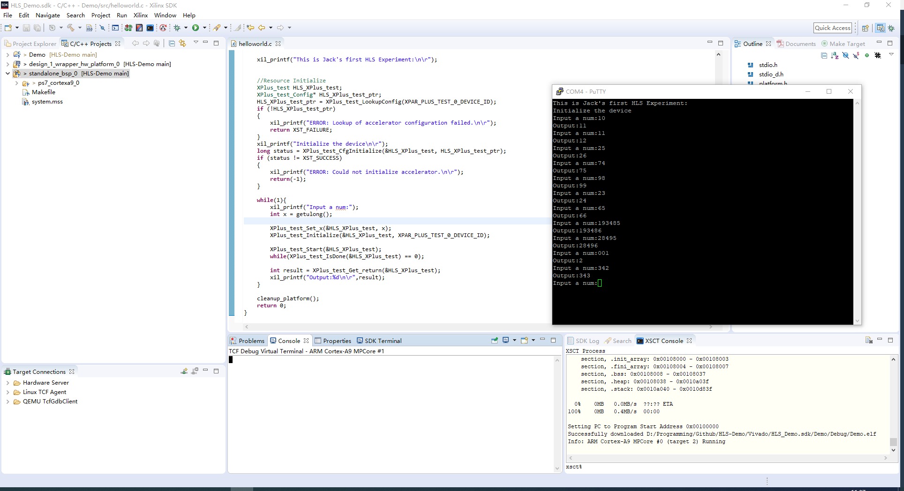

# HLS-Demo
A Demo Project for Vivado HLS.

## Objective
Implemented a simple arithmatic add (+1) named `plus_test` in PL side using axi-lite bus based on Vivado HLS;

Integrated IP `plus_test` and `Zynq_Processing_System`, export them to SDK.

In SDK, implemented receive num from serial console, invoke HLS function in FPGA, and get return value and display on serial console.